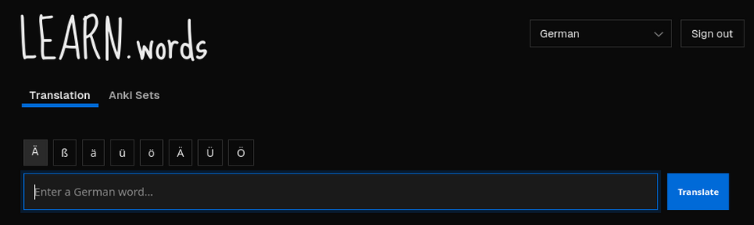
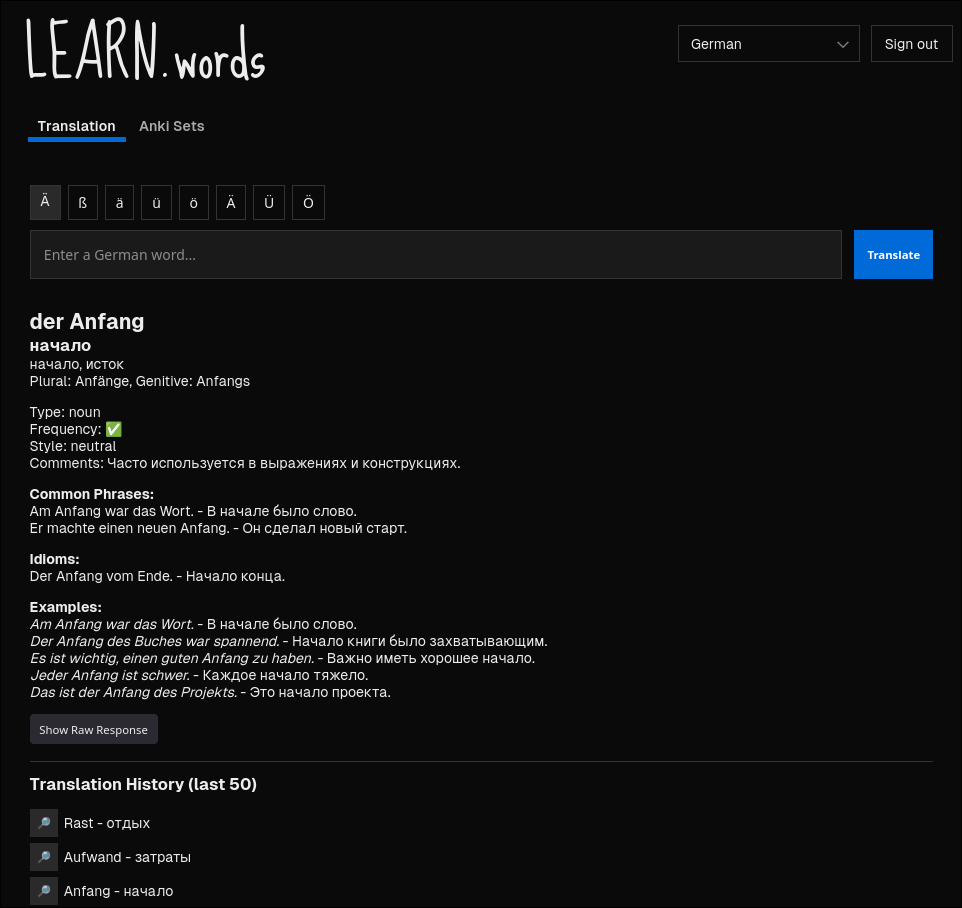

# Learn.words

Learn.words is an LLM-powered vocabulary app for translating words, phrases, and short sentences, saving translation history, and turning useful entries into Anki study material.

The goal is not just to return a direct translation, but to give enough context to actually learn the word: grammar notes, frequency, usage comments, word forms, and example sentences.

## What It Does

- Translates input with learning-focused context instead of a minimal dictionary-style answer
- Saves recent translation history
- Organizes saved items into Anki sets
- Exports study material for Anki in `.csv` and `.apkg` formats

## Supported Translation Directions

Currently supported:

- German -> Russian
- Norwegian -> Russian
- English -> Russian

More language pairs are planned.

## Interface Preview

The main screen is built around fast input, quick character insertion for language-specific letters, and one-click translation.

## Export Options

### CSV Export

CSV is currently the most reliable export format for Anki. It preserves more than just the source word and translation, including examples, grammar details, and word forms. You can map these fields in Anki note types and card templates to build richer study cards.

### `.apkg` Export Behavior

Because of a limitation in the current third-party export library, `.apkg` exports do not yet create a single Anki note with multiple sibling cards. Instead, each study direction or variant is exported as a separate note/card entry.

Practical consequences:

- Cards generated from the same source item are scheduled independently in Anki
- Sibling burying behavior does not apply between those variants
- Editing one exported note in Anki does not update the related variants

CSV is the better option if you want full control over the Note structure.

## Next Steps

- Improve `.apkg` export so related cards are generated as sibling cards under one note
- Add more translation directions
- Improve Anki set management and export customization
- Refine prompt output for cleaner examples and more consistent grammar metadata
- Add a smoother onboarding flow for first-time users
