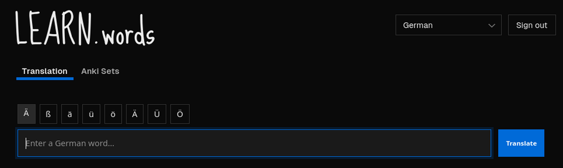
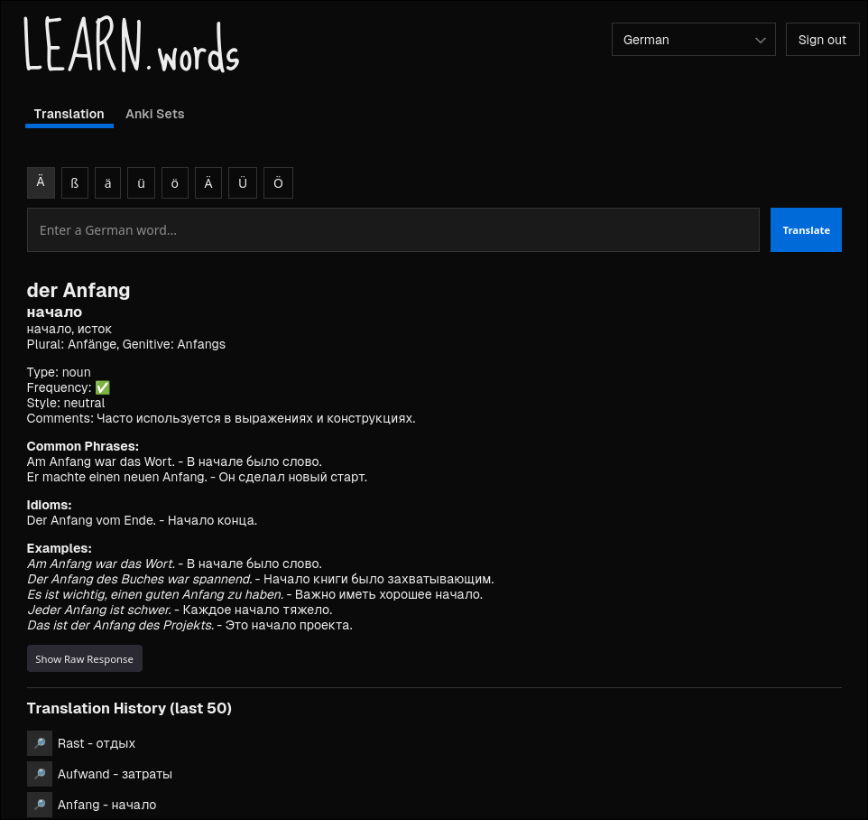

# Learn.words

Learn.words is an LLM-powered vocabulary app for translating words, phrases, and short sentences, saving translation history, and turning useful entries into Anki study material.

The goal is not just to return a direct translation, but to give enough context to actually learn the word: grammar notes, frequency, usage comments, word forms, and example sentences.

## What It Does

- Translates input with learning-focused context instead of a minimal dictionary-style answer
- Saves recent translation history
- Organizes saved items into Anki sets
- Exports study material for Anki in `.csv` and `.apkg` formats

## Supported Translation Directions

Currently supported:

- German -> Russian
- Norwegian -> Russian
- English -> Russian

More language pairs are planned.

## Interface Preview

The main screen is built around fast input, quick character insertion for language-specific letters, and one-click translation.

## Export Options

### `.apkg` Export Behavior

`.apkg` exports include the `Gooseberry Vocabulary v1` note type, its structured fields, styling, and five card templates:

- Recognition: source word to translation
- Production: translation to source word
- Word forms, when forms are available
- Example recall, when an example and its translation are available
- Typed production using Anki's native answer comparison

Each vocabulary item is one Anki note. Its applicable study cards are siblings, so Anki can bury related cards and an edit to the note updates every variant. Stable note identities allow later exports to update previously imported notes.

### CSV Export

CSV is the portable fallback. 
It preserves more than just the source word and translation, including examples, grammar details, and word forms, but requires manual field mapping to an existing Anki note type.

## Next Steps

- Add more translation directions
- Add a smoother onboarding flow for first-time users
- Add optional direct import through AnkiConnect
