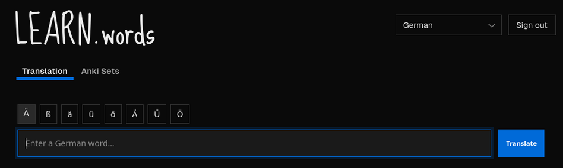
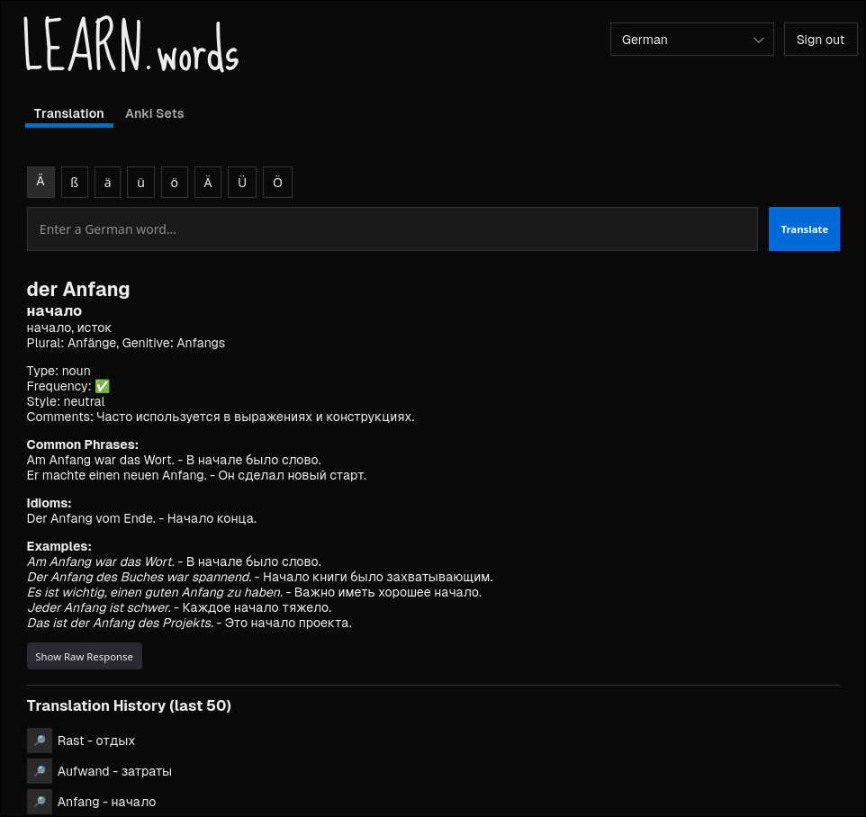

# Learn.words



Learn.words is an LLM-powered vocabulary app for translating words, phrases, and short sentences, saving translation history, and turning useful entries into Anki study material.

The goal is not just to return a direct translation, but to give enough context to actually learn the word: grammar notes, frequency, usage comments, word forms, and example sentences.

## What It Does

- Translates input with learning-focused context instead of a minimal dictionary-style answer
- Saves recent translation history
- Organizes saved items into Anki sets
- Exports study material for Anki in `.csv` and `.apkg` formats

## Supported Translation Directions

Currently supported:

- German -> Russian
- Norwegian -> Russian
- English -> Russian

More language pairs are planned.

## Interface Preview

The main screen is built around fast input, quick character insertion for language-specific letters, and one-click translation.



## Export Options


### `.apkg` Export Behavior

`.apkg` exports include the `Gooseberry Vocabulary v1` note type, its structured fields, styling, and five card templates:

- Recognition: source word to translation
- Production: translation to source word
- Word forms, when forms are available
- Example recall, when an example and its translation are available
- Typed production using Anki's native answer comparison

Each vocabulary item is one Anki note. Its applicable study cards are siblings, so Anki can bury related cards and an edit to the note updates every variant. Stable note identities allow later exports to update previously imported notes.

### CSV Export

CSV is the portable fallback. 
It preserves more than just the source word and translation, including examples, grammar details, and word forms, but requires manual field mapping to an existing Anki note type.

## Next Steps

- Add more translation directions
- Add a smoother onboarding flow for first-time users
- Add optional direct import through AnkiConnect

## Development

Use Node 24 (see `.nvmrc`) and pnpm. `pnpm-lock.yaml` is the dependency lockfile.

```sh
pnpm install --frozen-lockfile
pnpm dev
```

Run `pnpm test`, `pnpm typecheck`, `pnpm lint`, and `pnpm build` to validate changes.
The production build needs network access to download the Google font.

Linting uses Oxlint with the migrated Next.js, TypeScript, React, import, and
accessibility rules in `.oxlintrc.json`. Prettier remains the formatter. The React
Compiler rules are explicitly enabled to preserve the previous checks; their
Oxlint implementations are experimental. Existing application lint findings are
still reported as errors or warnings, rather than suppressed during migration.

The migration preserves 80 rules, with two coverage gaps: Next.js's
`no-location-assign-relative-destination` is not implemented in Oxlint, and
`react/no-deprecated` needs the separate type-aware `typescript/no-deprecated`
rule. JSX variable tracking is built in; the old React Compiler `config` and
`gating` rules do not apply to Oxlint's fixed compiler configuration.

TypeScript 7 runs `pnpm typecheck` and the Next.js build's type checks through
`experimental.useTypeScriptCli`. Test helpers explicitly import
`@typescript/typescript6` for its `transpileModule` API, which TypeScript 7.0 does
not provide. The two packages expose separate `tsc` and `tsc6` commands. Keep the
compatibility package until those helpers no longer need the TypeScript 6 API.
Node types follow the Node 24 runtime, and NextAuth stays on the v5 beta release
track.
